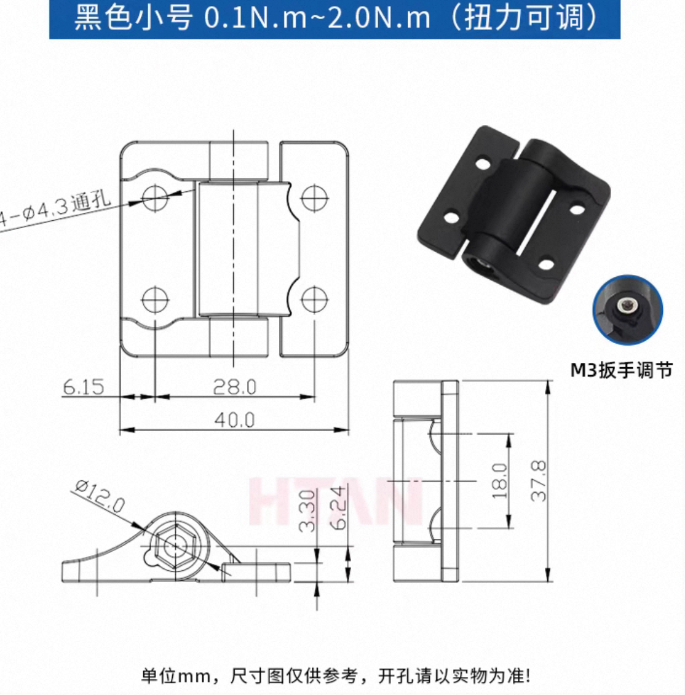

# Crosses Hinge

A case designed for [Crosses](https://github.com/Good-Great-Grand-Wonderful/crosses?tab=readme-ov-file), allowing adjustments to the **tenting angle**, **thumb cluster offset**, and **trackball position**.

- Only supports a **3x5 key matrix**.

## Parts
* 3x5 Matrix Case
* Thumb Cluster Case
* Top Part of the Trackball Stand

All parts are designed based on *the right-hand side.*
If needed, mirror them for the left side.

Fillets have been optimized for FDM 3D printing.

## BOM

Only lists **additional** components required (A SIDE)

* M3x5mm screws × 4
* M3x3mm threaded insert × 1
* 140mm FFC cable
* Lockable hinge

  * Finding the exact part may be difficult. Please compare the dimensions provided and choose accordingly.
  * Source: [Taobao](https://detail.tmall.com/item.htm?id=735513025680)
  * 

## License

[CC BY-NC 4.0](https://creativecommons.org/licenses/by-nc/4.0/)

 
